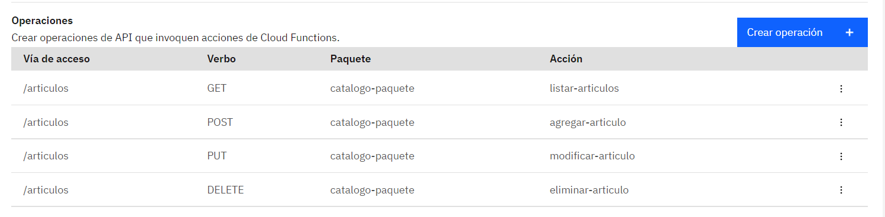
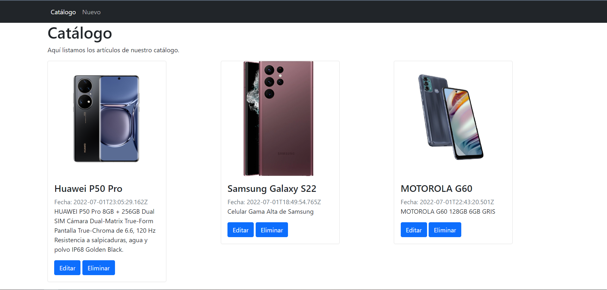
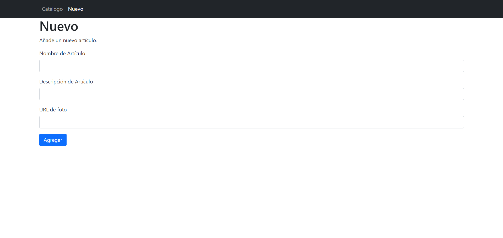
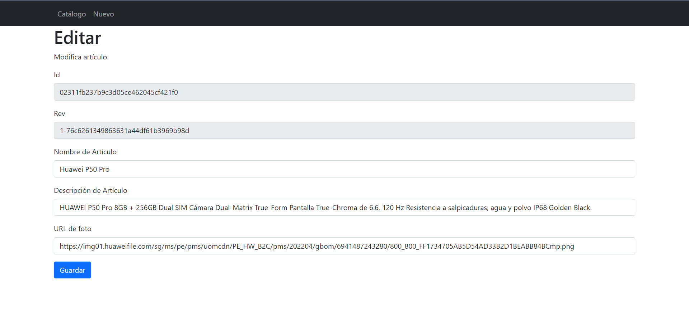
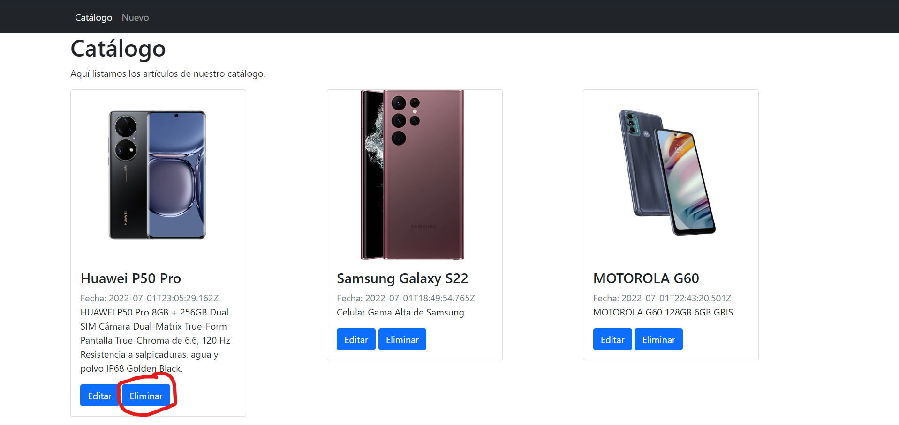

# Serverless App con IBM Cloud Functions
Ejemplo de un aplicativo Android que consume una Rest Api y atentificada por IBM Cloud App ID.

## Arquitectura

1.	El usuario acceder a la aplicación alojada en el grupo de Object Storage
2.	La aplicación web llama a una API de programa de fondo.
3.	La API de programa de fondo se define en API Gateway.
4.	API Gateway reenvía la solicitud a Cloud Functions.
5.	Las acciones de Cloud Functions utilizan IBM Cloudant para almacenar y recuperar entradas del registro de visitas.

## API

## Capturas

### Catálogo

### Nuevo Artículo

### Modificar Artículo

### Eliminar Artículo

